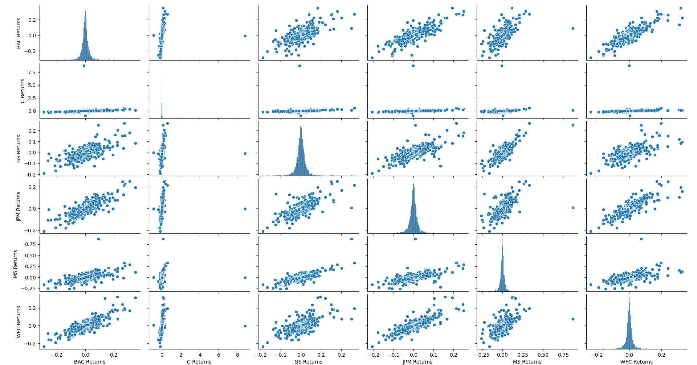
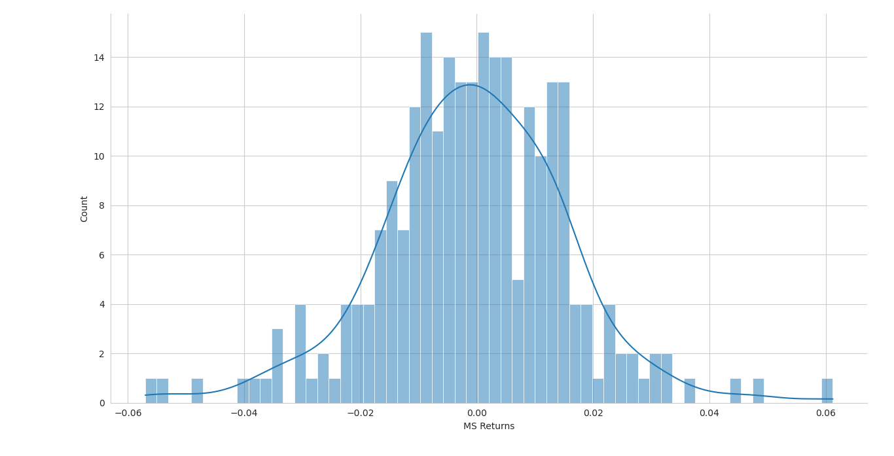
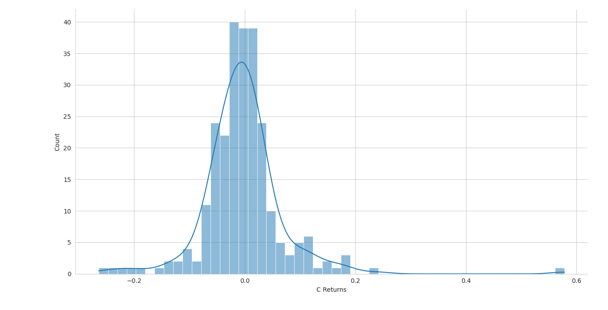
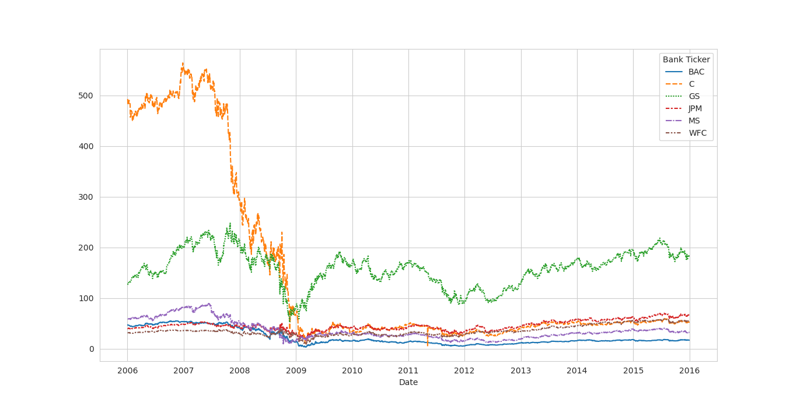
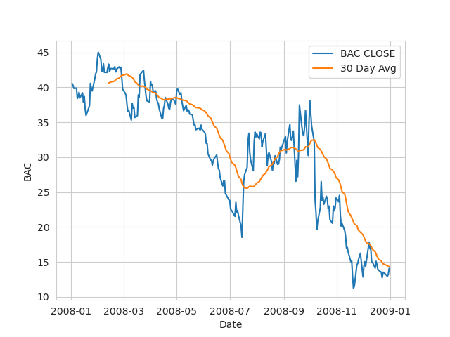
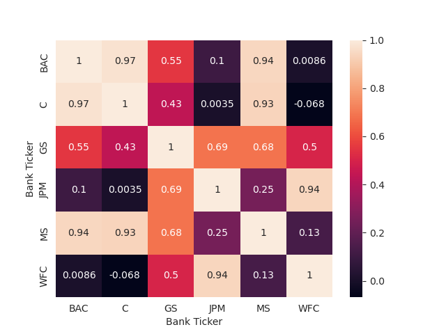
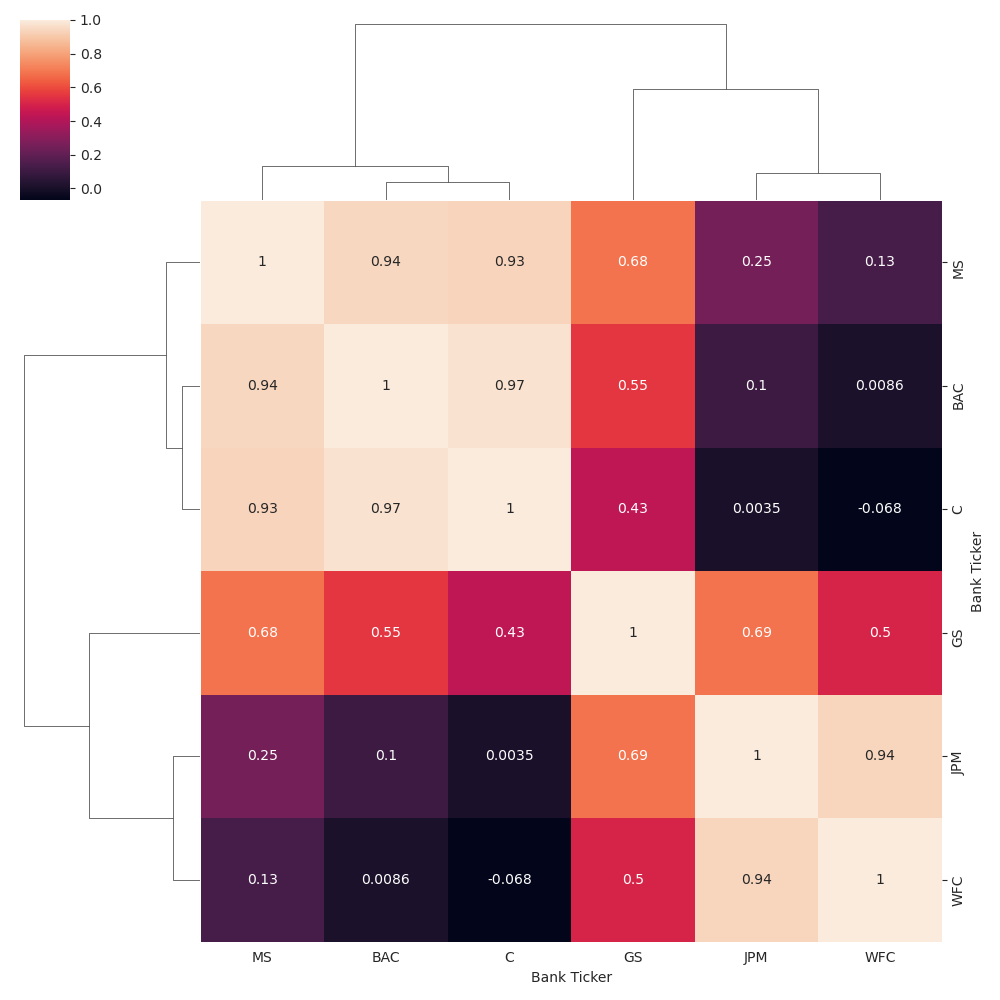

# Stocks Data Visualizations
 

We need to get data using pandas datareader. The first step is to grab the stock info for the following banks:

-    Bank of America
-    CitiGroup
-  Goldman Sachs
-   JPMorgan Chase
-   Morgan Stanley
-   Wells Fargo


Our next goal is to grab the stock data from **Jan 1st 2006** to **Jan 1st 2016** for each of these banks. To do this, we can set each bank to be a seperate dataframe, with the variable name for that bank being its ticker symbol. To create a ticker symbol, we need to:

1. Use datetime to set start and end datetime objects.
2. Figure out the ticker symbol for each bank.
3. Figure out how to use datareader to grab info on the stock.


First, let's import all the necessasry libraries into our file:

````python
from pandas_datareader import data
import datetime  
import pandas as pd
````

We can now set datetime to set the start and end datatime objects, particularly from 2006 to 2016:

````python
start = datetime.datetime(2006, 1, 1)
end = datetime.datetime(2016, 1, 1)
````
We can create a list of tickers representing each bank set a for loop that will iterate through each ticker and use datareader to pull each banks's stock data using the start and end datetime objects.

````python
# create the keys for the our new dataframe
tickers = ['BAC', 'MS', 'C', 'WFC', 'GS' , 'JPM' ]

# Reading in and storing each bank's stock data in a list
listOfBanks = [
        data.DataReader(item, 'stooq', start, end) for item in tickers
        ] 
````
We can us the `concat` function to concatenate all the stock data into one dataframe.
````python
bank_stocks = pd.concat(listOfBanks , axis = 1 , keys = tickers)

bank_stocks.columns.names = ['Bank Ticker', 'Stock Info']
````


What is the max Close price for each bank's stock throughout the time period?

````python
df.xs('Close', axis = 1 , level = 'Stock Info' ).max()
````

Create a new empty DataFrame called returns. This dataframe will contain the returns for each bank's stock. Returns are typically defined by:
 
$$
    r_t = \frac{p_t - p_{t-1}}{p_{t-1}} = \frac{p_t}{p_{t-1}} - 1
$$

We can use pandas function `pct_change()` method on the Close column to create a column representing this return value. Create a for loop that takes each Bank Stock Ticker and place it in a new column called `returns`.

````python
tickerList = ['BAC', 'C', 'GS', 'JPM', 'MS', 'WFC'] 

returns = pd.DataFrame() # creates the 'returns' column

for ticker in tickerList:
   returns[ticker + " Return"] = df['ticker']['Close'].pct_change() # fills in the values of the dataframe using percent changes from the dataframe 'df'

print(returns) # returns the dataframe 'return'

````

Create a pairplot using seaborn of the returns dataframe. What stock stands out to you? Can you figure out why?

````python
sns.pairplot(data = returns)
plt.show()
````



The one the stands out the most would be the `C Return` because the data is more skewed compared to the other banks.

Using this `returns` DataFrame, figure out on what dates each stock had the best and worst single day returns. You should notice that 4 of the banks share the same day for the worst drop, did anything significant happen that day?

**Ans:** Four of those banks experienced the 2009 recession.

Best single day returns:

````python
returns.idxmax()
````
````
BAC Returns   2009-04-09
C Returns     2011-05-09
GS Returns    2008-11-24
JPM Returns   2009-01-21
MS Returns    2008-10-13
WFC Returns   2008-07-16
dtype: datetime64[ns]
````

Worst single day returns:

````python
returns.idxmin()
````

Take a look at the standard deviation of the returns, which stock would you classify as the riskiest over the entire time period? Which would you classify as the riskiest for the year 2015? 

- Standard Deviation of Returns for the entire time period:
````python
returns.std()
````

````
BAC Returns    0.036650
C Returns      0.179969
GS Returns     0.025346
JPM Returns    0.027656
MS Returns     0.037820
WFC Returns    0.030233
dtype: float64
````

- Standard Deviation of returns in 2015:

Let's check out the head of the dataframe again.


````
            BAC Returns  C Returns  GS Returns  JPM Returns  MS Returns  WFC Returns
Date                                                                                
2006-01-03          NaN        NaN         NaN          NaN         NaN          NaN
2006-01-04    -0.010620  -0.018462   -0.013812    -0.014183    0.000686    -0.011599
2006-01-05     0.001288   0.004961   -0.000393     0.003029    0.002742    -0.000951
2006-01-06    -0.001501   0.000000    0.014169     0.007046    0.001025     0.005714
2006-01-09     0.000644  -0.004731    0.012030     0.016242    0.010586     0.000000
````

We can use the `loc[]` function from pandas to grab all thr rows of values during the year 2015.


````python
returns.loc['2015']
````

````
            BAC Returns  C Returns  GS Returns  JPM Returns  MS Returns  WFC Returns
Date                                                                                
2015-01-02     0.000559   0.002772    0.002992    -0.001438   -0.002320    -0.002189
2015-01-05    -0.029050  -0.031515   -0.031223    -0.031045   -0.031258    -0.027422
2015-01-06    -0.029919  -0.035205   -0.020229    -0.025929   -0.028800    -0.020865
2015-01-07     0.004745   0.009270    0.014903     0.001526    0.014278     0.005951
2015-01-08     0.020661   0.015048    0.015965     0.022346    0.014889     0.022137
````

To find the standard deviation, we can just call `std()` function off of this dataframe 

````python
returns.loc['2015'].std()
````
and get the following series:

````
BAC Returns    0.016163
C Returns      0.015289
GS Returns     0.014046
JPM Returns    0.014017
MS Returns     0.016249
WFC Returns    0.012591
dtype: float64
````

We can visualize this data by using a displot from seaborn.


````python
sns.displot(data = returns['MS Returns'].loc['2015'], 
    kde = True, 
    bins = 60)

plt.show()
````




Now let's visualize CitiGroup's returns during the 2008 year.


````python
sns.displot(data = returns['C Returns'].loc['2008'], 
    kde = True, 
    bins = 50)

plt.show()
````



Now let's create a lineplot for the close prices of each bank across the entire time period.

````python
closePrice = df.xs( key = 'Close',
    axis = 1,
    level = "Stock Info")
sns.displot(data = closePrice)
plt.show()
````



## Moving Averages

Let's analyze the moving averages for the 2008 year. To do this we will create a line plot for the rolling 30 day average against the Close Price for Bank of America's stock for 2008.

Using the `xs()` function, we can type
````python
closePriceBAC = df.xs(key = 'Close', axis = 1 , level = 'Stock Info')['BAC'].loc['2008']
rollingAvg = closePriceBAC.rolling(30).mean()

sns.lineplot(data = closePriceBAC , label = 'BAC CLOSE')
sns.lineplot(data = rollingAvg  , label = '30 Day Avg')
plt.legend(loc = 'upper right')
plt.savefig('./plots/BACrollingAvg.png')
plt.show()
````

which return the following plot:



We can visualize the same data using a heatmap.

````python
closePrice = df.xs(
    key = 'Close', 
    axis = 1 , 
    level = 'Stock Info'
    )

sns.heatmap(data = closePrice.corr() , annot = True)
plt.savefig('./plots/heatmapClosePrice.png')
plt.show()

````


Alternatively, we can visualize the same data with a cluster map.

````python
sns.clustermap(data = closePrice.corr(), annot = True)
plt.savefig('./plots/clustermapClosePrice.png')

````




## Optional Visualizations


We can create interactive visualizations using the plotly and cuffliknks library. Import the following libraries:
````python
import plotly
import cufflinks as cf
cf.go_offline()
````

Suppose we wanted to visualize Bank of America's stock from Jan 1st 2015 to Jan 1st 2016 using the a candle plot.
````python
dataBAC = df['BAC'].loc['2015': '2016']
dataBAC.iplot(kind = 'candle')
````

Use .ta_plot(study='sma') to create a Simple Moving Averages plot of Morgan Stanley for the year 2015.

````python
closePrice = df.xs(key = 'Close', axis = 1, level = "Stock Info")
dataMS = closePrice['MS'].loc['2015']
dataMS.ta_plot(study = 'sma')
````
Use .ta_plot(study='boll') to create a Bollinger Band Plot for Bank of America for the year 2015.

````python
closePriceBAC = df.xs(key = 'Close', axis = 1, level = "Stock Info")['BAC'].loc['2015']
closePriceBAC.ta_plot(study = 'boll')
````


